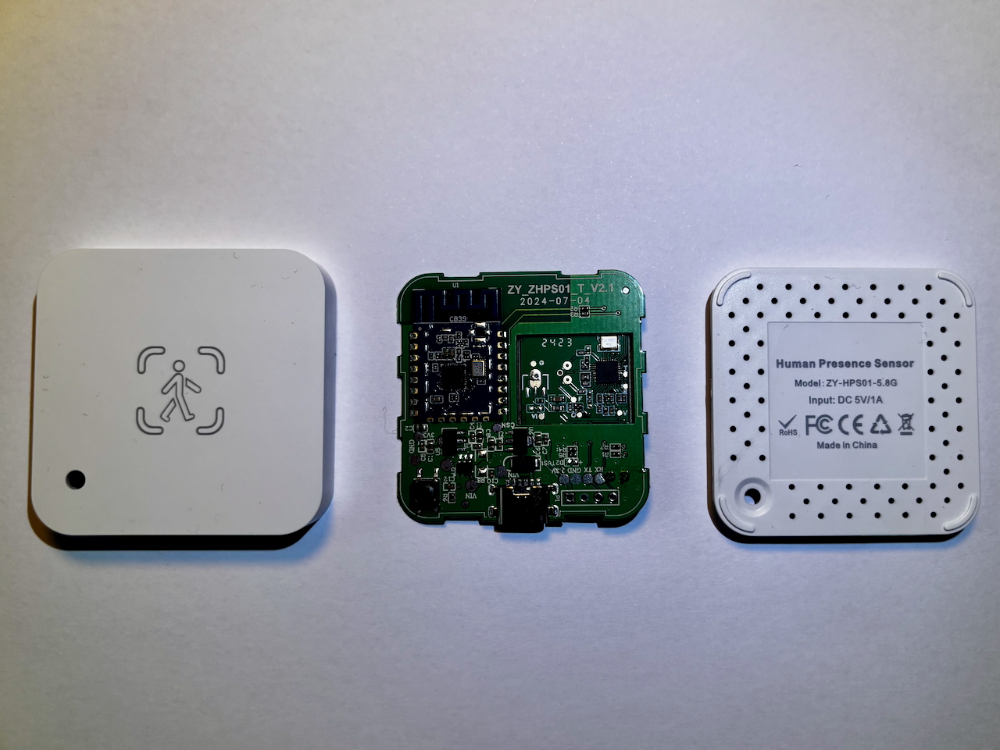
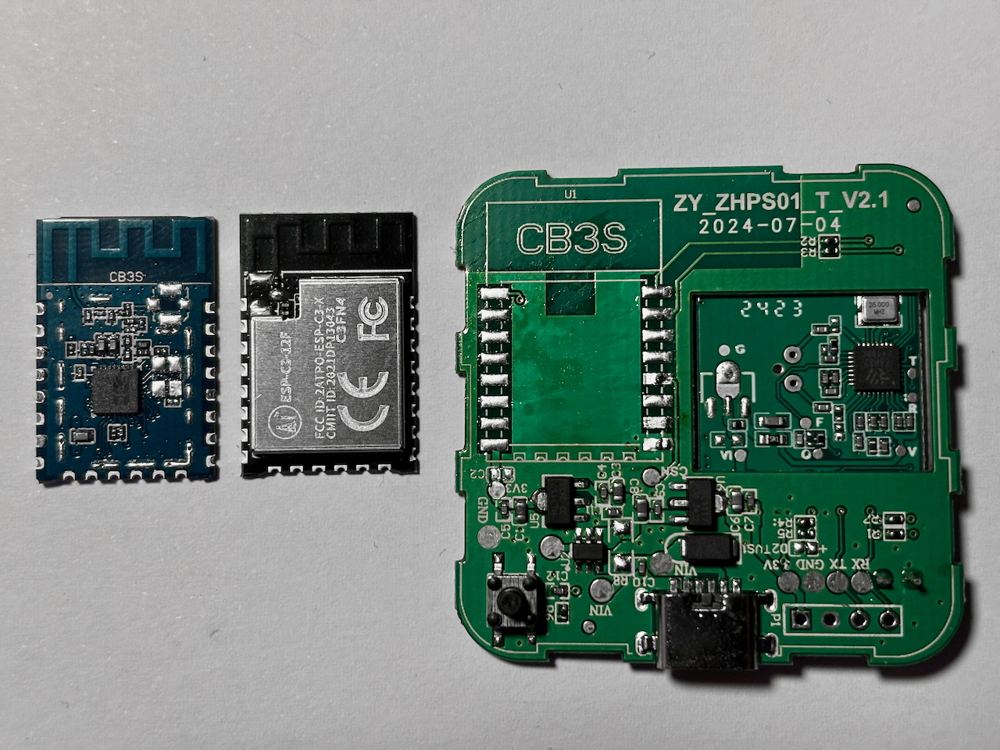
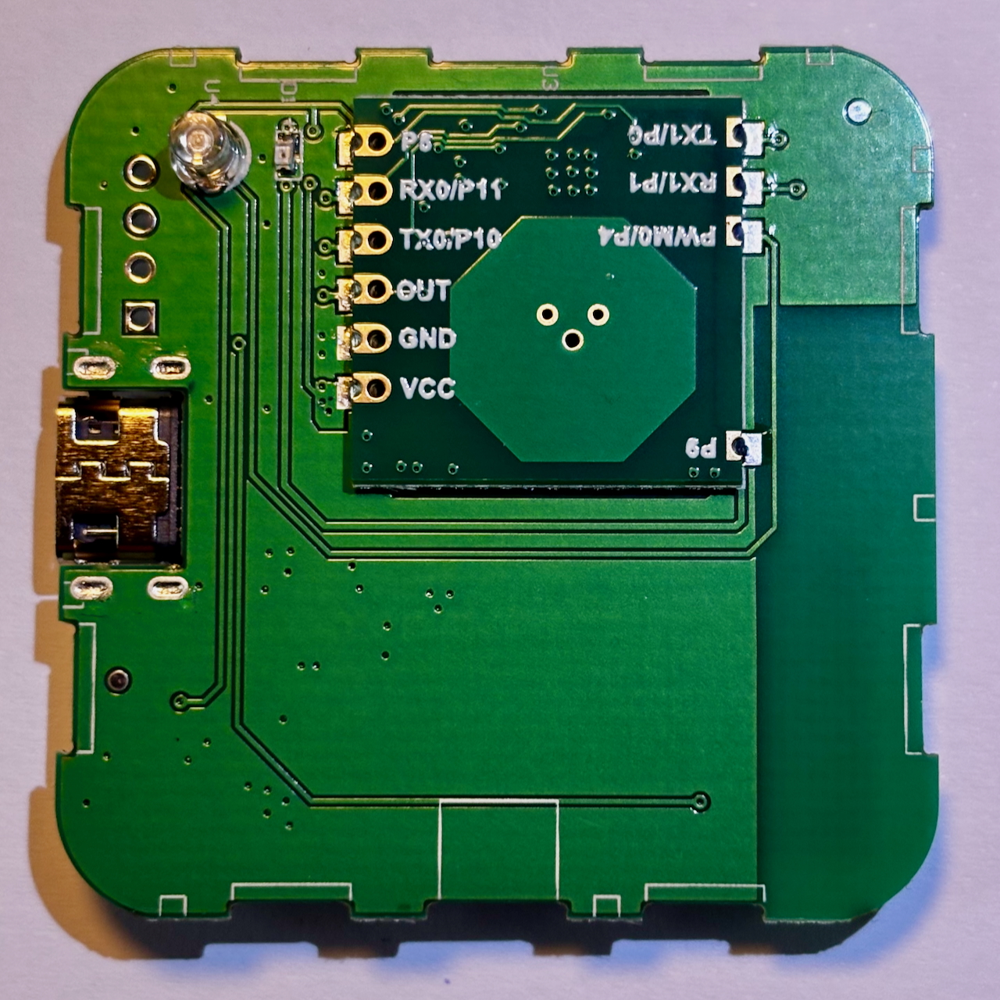
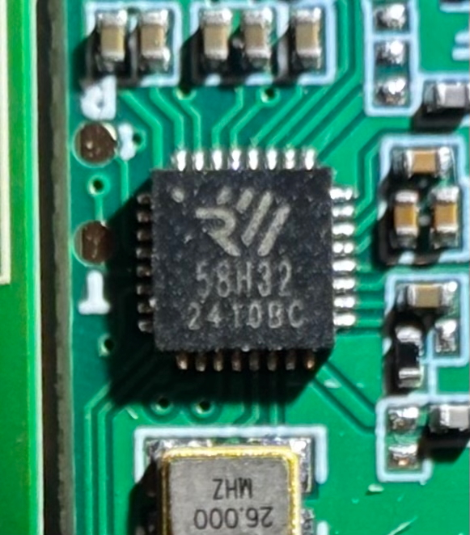

# ZY-ZHPS01 mmWave Presence Sensor 5.8 GHz

ZY_ZHPS01_T_V2.1 / 2024-07-04. <br>
CB3S + Airtouch [AT5820](https://en.airtouching.com/product/29.html), module looks like a customized version from [MoreSense](https://miganiot.com/product/ms58-2020d20m4-live) .

## dpIds
```
 dpIDs
   11 | light intensity    |  0-950 lux |  tuyaMCU 75,11
  101 | presence
  104 | presencedelay      |  holdtime: 30-180s
  105 | sensitivity        |  0-x10 
  107 | microsensitivity   |  0-x10
  109 | maxrange           |  0-6m
  110 | minrange           |  0-6m
  111 | micromaxrange      |  0-6m
  112 | microminrange      |  0-6m
  113 | unkown
```
## Images
DUT

<br>

<br>

<br>

<br>
